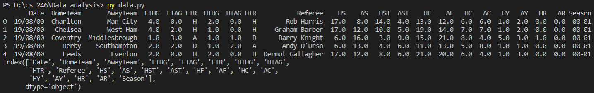

## Overview
This program takes the data from premierleague.csv and the analyizes it to answer two questions. This is the show my knowledge and use of the pandas library

### Enviorment:
I used visual studio code with python and git downloaded. I also added the pandas and numpy libraries to the enviorment.

##### Running the Program:
I simpy inputed "python data.py" into the terminal and it displayed the results.

##### Screenshot:

##### Helpful Websites: 
https://kaggle.com 
https://pandas.pydata.org/
